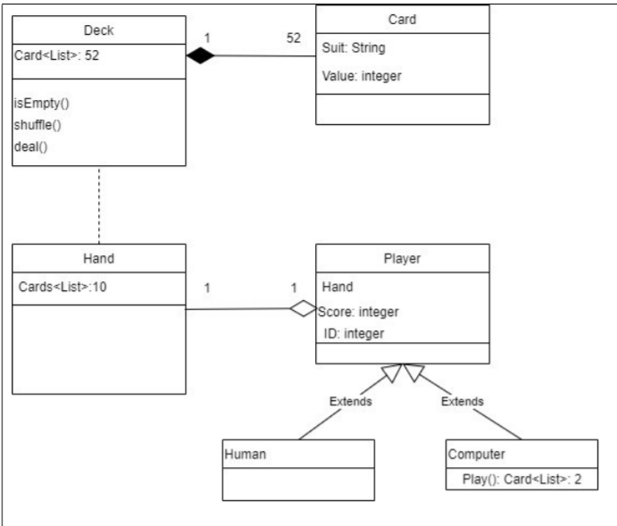

# CardGame
University of Lincoln Assignment game

# How does the game work?
The basic play for the game is this:
Card game: 'Lincoln'
 2 x players
 PvC (Player v Computer)
 Pack is shuffled.
 Each player receives 10 cards.
 Each player plays 2 cards.
 Player with highest total wins hand, then plays first on the next round.
 Card values are: 2,3,4,5,6,7,8,9,10,J(11),Q(12),K(13),A(14)
 eg: P1 plays (8,Q) total=20
 P2 plays (5,K) total=18
 P1 wins hand
Notes:
If totals are the same, continue to next hand. Winning player gets both hands.
Player with highest number of hand wins, wins the game.
If the number of hand wins are the same, draw a random card from the remaining
cards - highest wins.
If the final hands are the same value, draw a random card from the remaining cards -
highest wins the hand. 

# UML Design

# Knowledge and Skill gained/assessed
1. Subject Specific Knowledge, Skills and Understanding:
Object Oriented principles
Testing
C# programming;
2. Professional Graduate Skills:
Independence and personal responsibility, written communication
3. Emotional Intelligence:
Motivation, self-confidence, self-assessment.
4. Career-focused Skills:
OO development;
Testing;
C# programming
